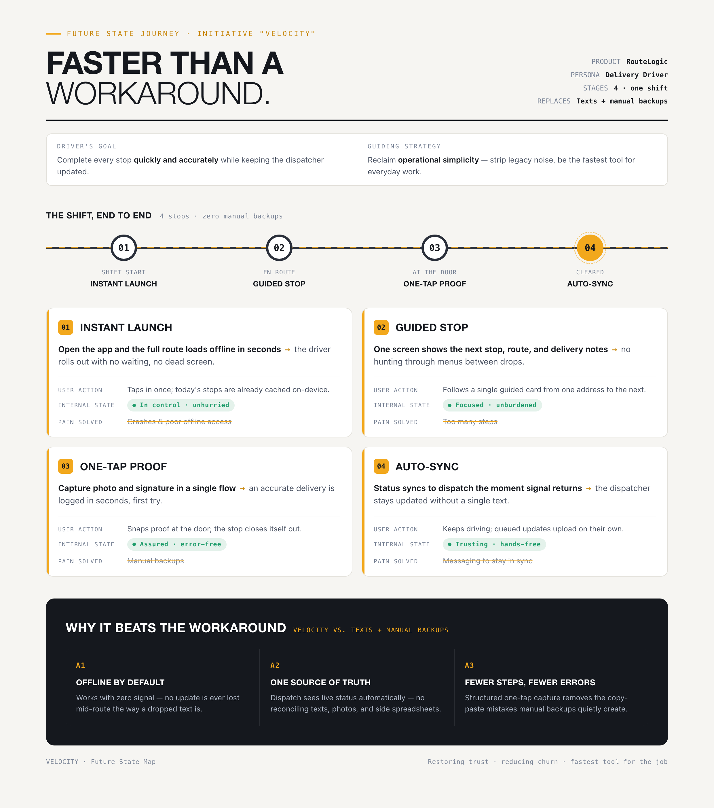

# Competitive Analysis & Journey Map

> Module 2 · Discover Product Opportunities via Qualitative Signals — ★ Deliverable 2

## Workaround summary

Delivery drivers use route screenshots, paper manifests, WhatsApp, text messages, and phone calls when RouteLogic is slow, offline, or crashes.

Before starting a route, some drivers save a screenshot or carry a paper manifest as a backup. If the app fails, they use the backup and contact the dispatcher to report deliveries or recover missing stop information. This creates delays and makes it difficult for drivers and dispatchers to trust that they have the same up-to-date information.

## High-level journey map

| Stage | User action | Benefit | Friction removed |
|---|---|---|---|
| Start | Open the route with offline access | Continue working with weak or no signal | Blank or missing stop list |
| Navigate | Receive route changes immediately | Avoid following outdated directions | Delayed route updates |
| Deliver | Confirm delivery and photo in fewer steps | Save time at every stop | Excessive taps and failed uploads |
| Update | Sync delivery status automatically | Keep dispatch informed without calls or messages | Dashboard lag and manual communication |

## Journey map artifact

