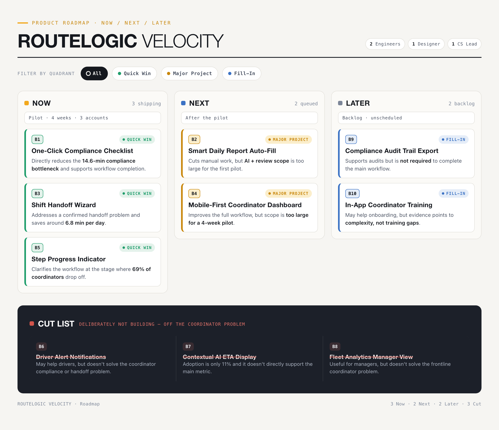

# Roadmap, PRD & Prototype

> Module 4 · Build High-Velocity Product Roadmaps — ★ Deliverable 4
>
> _You'll complete this during Module 4._

## High-level product roadmap

RouteLogic Velocity focuses on simplifying compliance and shift handoff for frontline logistics coordinators.

### Now — Four-week pilot

- B1 · One-Click Compliance Checklist
- B3 · Shift Handoff Wizard
- B5 · Step Progress Indicator

### Next — After the pilot

- B2 · Smart Daily Report Auto-Fill
- B4 · Mobile-First Coordinator Dashboard

### Later

- B9 · Compliance Audit Trail Export
- B10 · In-App Coordinator Training

### Cut

- B6 · Driver Alert Notifications
- B7 · Contextual AI ETA Display
- B8 · Fleet Analytics Manager View

The Now features directly address the main coordinator friction and fit the four-week pilot scope.

---

## PRD snippets

### Feature

**One-Click Compliance Checklist**

A pre-filled checklist that helps frontline coordinators complete compliance checks faster.

### Persona

Frontline logistics coordinators.

### Vision

Help frontline coordinators complete compliance checks faster through one clear, pre-filled workflow.

### Problem

Compliance checks take 14.6 minutes compared with the 3-minute benchmark, and manual workarounds waste around 31 minutes per day.

### Success metrics

- **Primary metric:** Increase coordinator workflow completion after route assignment by 25%.
- **Guardrail:** Compliance error rate must not increase.

### Must-Have scope

- Open the checklist from the assigned route.
- Pre-fill available compliance information.
- Allow coordinators to review pre-filled information and edit compliance fields that need input.
- Flag missing required information.
- Block submission when required information is missing or invalid.
- Require review confirmation before submission.
- Show a clear confirmation after submission.

### Features out

- Automatic compliance approval
- Daily report auto-fill
- Compliance audit PDF export
- Driver notifications
- Full dashboard redesign
- External system integrations
- Multi-route batch processing

### Validation learning

The prototype showed that the Cargo Weight field could accept a negative value and still allow submission. I updated the validation so it only accepts a number greater than zero and shows an inline error for invalid values.

---

## Wireframes / prototype

**Core flow:** Assigned Route → Compliance Checklist → Confirmation

[Open the clickable Bolt prototype](https://compliance-checklist-ic4n.bolt.host)

The prototype uses mock data only and does not connect to a backend, database, login, or external API.
